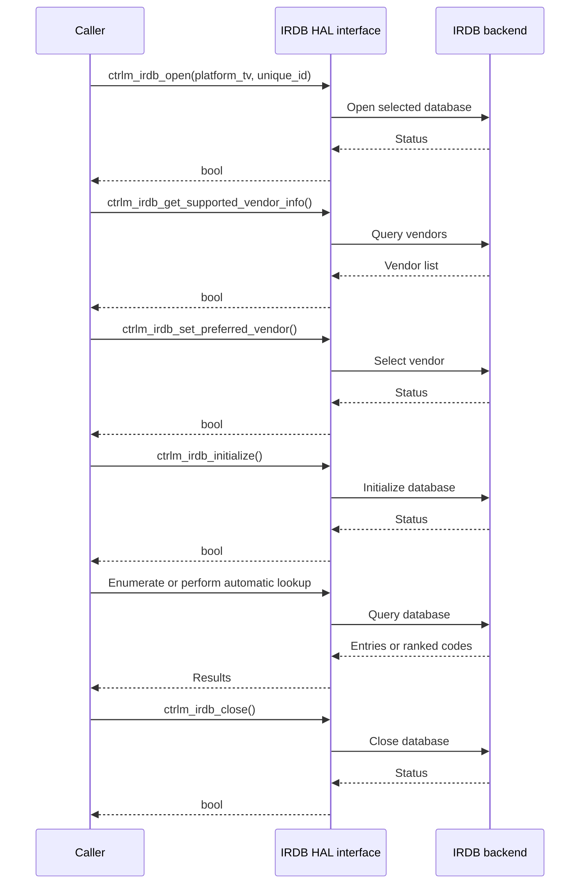

# IR Database HAL Interface Documentation

## Table of Contents

- [Acronyms, Terms and Abbreviations](#acronyms-terms-and-abbreviations)
- [References](#references)
- [Description](#description)
- [Component Runtime Execution Requirements](#component-runtime-execution-requirements)
  - [Initialization and Startup](#initialization-and-startup)
  - [Threading Model](#threading-model)
  - [Process Model](#process-model)
  - [Memory Model](#memory-model)
  - [Power Management Requirements](#power-management-requirements)
  - [Asynchronous Notification Model](#asynchronous-notification-model)
  - [Blocking Calls](#blocking-calls)
  - [Internal Error Handling](#internal-error-handling)
  - [Persistence Model](#persistence-model)
- [Non-functional Requirements](#non-functional-requirements)
  - [Logging and Debugging Requirements](#logging-and-debugging-requirements)
  - [Memory and Performance Requirements](#memory-and-performance-requirements)
  - [Quality Control](#quality-control)
  - [Licensing](#licensing)
  - [Build Requirements](#build-requirements)
  - [Variability Management](#variability-management)
  - [Platform or Product Customization](#platform-or-product-customization)
- [Interface API Documentation](#interface-api-documentation)
  - [Theory of Operation and Key Concepts](#theory-of-operation-and-key-concepts)
  - [Supported Data and Lookups](#supported-data-and-lookups)
  - [Operational Call Sequence](#operational-call-sequence)

## Acronyms, Terms and Abbreviations

- `IR` - Infrared
- `IRDB` - Infrared Database
- `HAL` - Hardware Abstraction Layer
- `API` - Application Programming Interface
- `RCU` - Remote Control Unit
- `CEC` - Consumer Electronics Control
- `EDID` - Extended Display Identification Data
- `InfoFrame` - HDMI Auxiliary Video Information Frame
- `OSD` - On-Screen Display
- `AVR` - Audio/Video Receiver
- `Caller` - Any component using the IRDB interface

## References

- [HDMI specification](https://www.hdmi.org/)
- [Doxygen documentation](https://www.doxygen.nl/manual/docblocks.html)
- [Apache License, Version 2.0](LICENSE)

## Description

The IRDB HAL interface provides a common C++ API for selecting an infrared database vendor, enumerating device entries, retrieving IR code sets, and automatically finding likely IR codes for connected HDMI devices.

The interface supports two device types:

- `CTRLM_IRDB_DEV_TYPE_TV` for televisions
- `CTRLM_IRDB_DEV_TYPE_AVR` for audio/video receivers

The interface supports offline, online, and hybrid database access modes. The selected implementation determines which modes and vendors are available at runtime. Vendor information includes a name and an RCU support bitmask, allowing a caller to select the preferred database implementation for its controller.

The public contract is declared in [include/ctrlm_irdb_plugin.h](include/ctrlm_irdb_plugin.h). The repository is an interface/header repository; an implementation supplies the database backend and platform integration.

## Component Runtime Execution Requirements

The caller is responsible for following the lifecycle described below. Calls return `bool` to indicate success or failure, except `irdb_version()`, which returns the database version string.

### Initialization and Startup

The caller must open the interface before initialization or database queries:

1. Call `ctrlm_irdb_open()` with the platform type and optional unique identifier.
2. Optionally call `ctrlm_irdb_get_supported_vendor_info()` to inspect installed vendors.
3. Call `ctrlm_irdb_set_preferred_vendor()` when a specific RCU-supported vendor should be selected.
4. Call `ctrlm_irdb_initialize()` before using database lookup and retrieval APIs.

The caller should check every return value. A failed open or initialization must prevent dependent calls from proceeding.

### Threading Model

The public header does not define a caller threading contract. Callers should serialize access unless the selected implementation explicitly documents concurrent-call support. Implementations are responsible for protecting shared backend state where required.

### Process Model

The interface represents the active database selection within the process. The implementation may maintain a process-wide active database instance, so callers should use one coordinated lifecycle per process.

### Memory Model

The caller owns storage passed to the API. Output containers are populated by the implementation and remain owned by the caller. The caller owns the `infoframe` and `edid` buffers passed to automatic lookup functions and must provide their lengths in bytes.

A retrieved `ctrlm_irdb_ir_code_set_t` contains waveform data indexed by `ctrlm_irdb_key_code_t`. The caller is responsible for retaining or releasing that C++ object according to normal C++ ownership rules.

### Power Management Requirements

The interface has no power-management API. A platform integration should preserve the selected vendor and reinitialize the backend as required after a power or connectivity transition.

### Asynchronous Notification Model

The public IRDB interface does not define callbacks or asynchronous notifications. All exposed operations return synchronously. Platform-specific discovery and notification mechanisms are outside this interface contract.

### Blocking Calls

The API does not define operation-specific timeout values. Database operations should complete within the limits required by the selected backend. Implementations must avoid indefinite blocking and return `false` when an operation cannot be completed.

### Internal Error Handling

The implementation reports operation success or failure through the return value. On failure, output arguments may be incomplete and must not be used unless the return value is `true`. Backend-specific logging and error details are implementation-defined.

### Persistence Model

The interface does not define persistence for the preferred vendor or retrieved code sets. The caller is responsible for persisting any vendor choice, database identifiers, or programmed-code state required across process restarts.

## Non-functional Requirements

### Logging and Debugging Requirements

The interface itself does not prescribe a logging API. Implementations should provide sufficient diagnostics for backend selection, initialization failures, unsupported vendors, failed lookups, and invalid device types without exposing sensitive platform data.

### Memory and Performance Requirements

Implementations should keep enumeration and lookup operations bounded by the size of the selected database and avoid retaining caller-owned input buffers. Automatic lookup may be performed for EDID, InfoFrame, and CEC data and should not block unrelated control operations longer than necessary.

### Quality Control

- Public declarations must remain compatible with the implementation ABI.
- Changes to API signatures, enums, or structure layouts require review by component owners.
- Doxygen should be run against the public header to verify that all public types and functions are documented.
- Static analysis and compiler warnings should be addressed according to the consuming project’s quality requirements.
- Tests should cover lifecycle failures, vendor selection, enumeration, code-set retrieval, and each automatic lookup source.

### Licensing

This interface is released under the Apache License, Version 2.0. See [LICENSE](LICENSE) and [NOTICE](NOTICE).

### Build Requirements

This repository provides the public interface header and documentation. It does not contain a standalone build system. A consuming implementation must provide the backend library and compile against `include/ctrlm_irdb_plugin.h`.

### Variability Management

Implementations may select different database vendors and access modes through build-time configuration. The public API must remain stable across supported vendor implementations. New vendors, device types, lookup sources, or key codes require interface review.

### Platform or Product Customization

Platform-specific behavior is represented by the `platform_tv` and optional `unique_id` arguments to `ctrlm_irdb_open()`. Other platform integration, including acquisition of EDID, InfoFrame, and CEC data, belongs to the consuming implementation.

## Interface API Documentation

The public API documentation is generated from Doxygen comments in [include/ctrlm_irdb_plugin.h](include/ctrlm_irdb_plugin.h).

### Theory of Operation and Key Concepts

The normal lifecycle is:

1. Open the IRDB with `ctrlm_irdb_open()`.
2. Inspect installed vendors with `ctrlm_irdb_get_supported_vendor_info()` and select one with `ctrlm_irdb_set_preferred_vendor()` when needed.
3. Initialize the selected database with `ctrlm_irdb_initialize()`.
4. Enumerate manufacturers, models, and entry IDs, or perform automatic lookup using EDID, InfoFrame, or CEC data.
5. Retrieve a code set with `ctrlm_irdb_get_ir_code_set()` and use its command waveforms.
6. Close the IRDB with `ctrlm_irdb_close()` when the interface is no longer needed.

The database enumeration path is:

### Supported Data and Lookups

#### Vendor and database lifecycle

- `irdb_version()` returns the active database version.
- `ctrlm_irdb_open()` and `ctrlm_irdb_close()` manage the database lifetime.
- `ctrlm_irdb_initialize()` initializes the opened database.
- `ctrlm_irdb_get_supported_vendor_info()` lists installed vendors.
- `ctrlm_irdb_set_preferred_vendor()` selects a vendor supported by the RCU.
- `ctrlm_irdb_get_vendor_info()` returns the active vendor.

#### Enumerated device data

- `ctrlm_irdb_get_manufacturers()` lists manufacturers for a device type and optional prefix.
- `ctrlm_irdb_get_models()` lists models for a device type and manufacturer.
- `ctrlm_irdb_get_entry_ids()` lists code-set identifiers for a manufacturer and model.
- `ctrlm_irdb_get_ir_code_set()` retrieves raw waveforms for supported keys such as power, mute, volume, and input selection.

#### Automatic lookup

The automatic lookup functions return ranked entries and the matched device type:

- `ctrlm_irdb_get_ir_codes_by_infoframe()` uses HDMI InfoFrame data.
- `ctrlm_irdb_get_ir_codes_by_edid()` uses EDID data.
- `ctrlm_irdb_get_ir_codes_by_cec()` uses a CEC OSD name, vendor ID, and logical address.

### Operational Call Sequence

